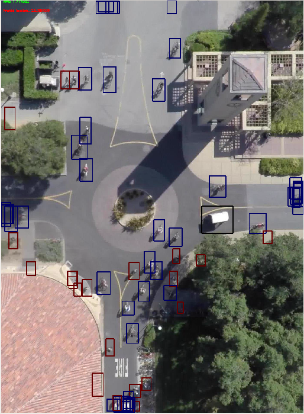

# In this folder we have put all the code we have used for working on the Stanford Drone Dataset

## You can download this dataset from here

[Stanford Drone Dataset link](http://cvgl.stanford.edu/projects/uav_data/)

**Note this Dataset is of 66 GB so please check if you enough space for this**

**Also we highly recommend you to download this using utilities like aria2 which are used for ultra fast downloading of almost anything**

**If you use wget it will take 3 days to download this and if you use aria2 it will take only 2 and a half hours at a given speed**

Use these commands to download the dataset

```
   sudo apt-get install aria2
   aria2c --file-allocation=none -c -x 16 -s 16 -d . http://vatic2.stanford.edu/stanford_campus_dataset.zip
```

## As of now we have uploaded a python script to visualize the ground truth results in the dataset
### (PS : They are very noisy and have a lot of false annotations)

**Here are the results of our code**




### Next we will upload the code we have written for converting the annotations.txt file to Tf-Records file. 


