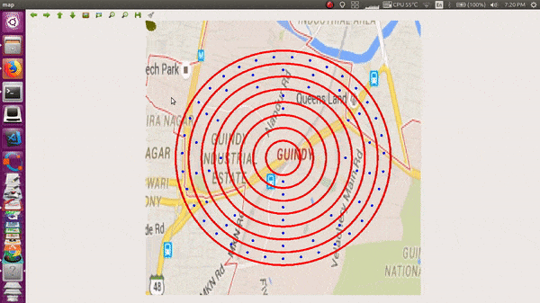

### This folder has the python script which creates a simulation of a scenario when multiple drones are used to cover an entire city

This algorithm tries to cover maximum area with for a region in minumum time keeping in mind the constraints like

1) Number of drones the army or relief task forces have.

2) The field of view of the camera of each drone (the region that it can surviell)

### In the entire algorithm you can change variables like 

1) Starting point of each drone (or the army headquarters)

2) The epicentre of the earthquake

3) The number of drones available

4) The total area of the impact of disaster (Radius of the earthquake)

**Note : We will further develop the algo so as to make the simulation more real by adding other constraints like the battery life of each drone.**
